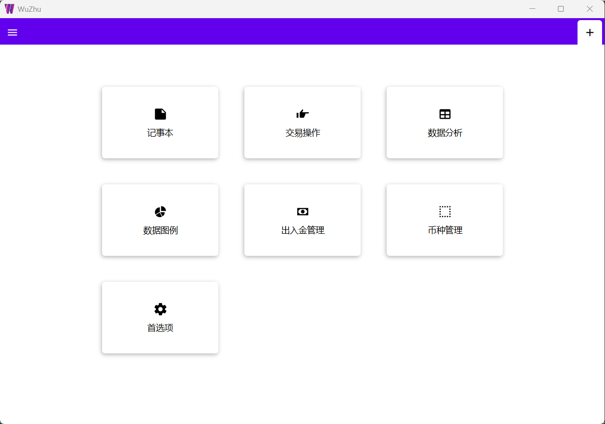
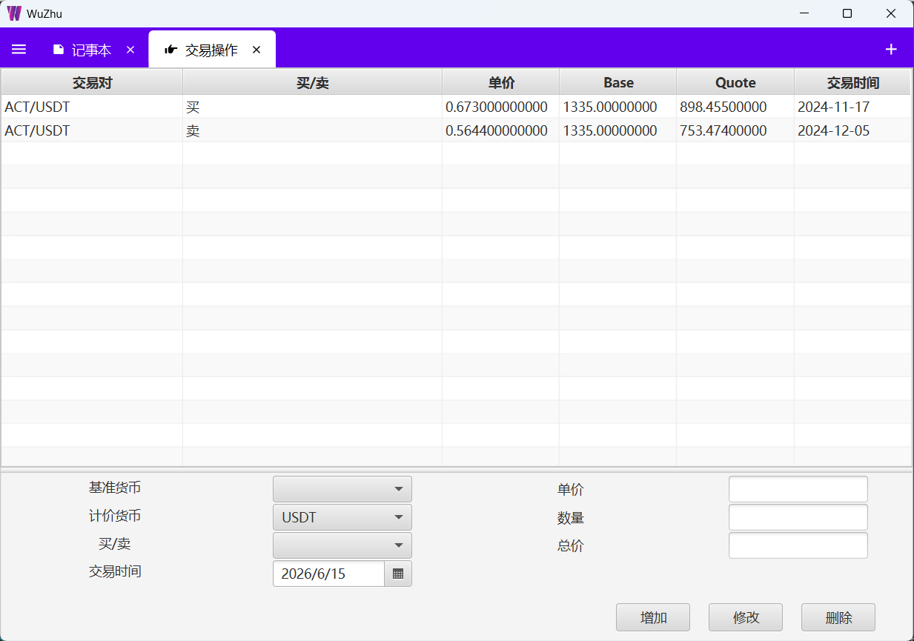
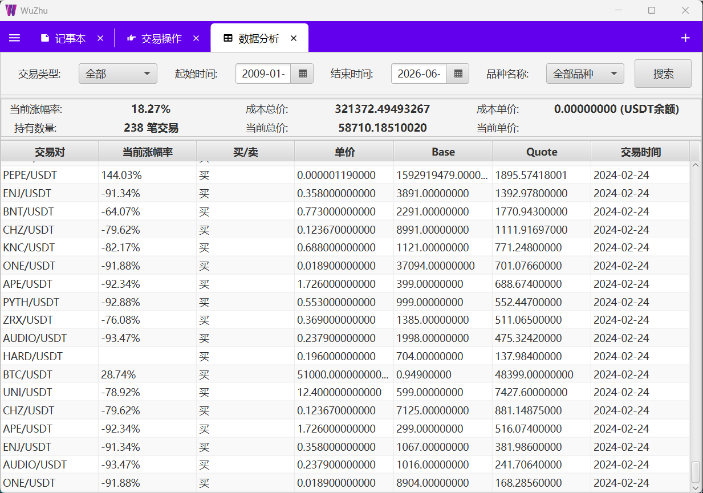
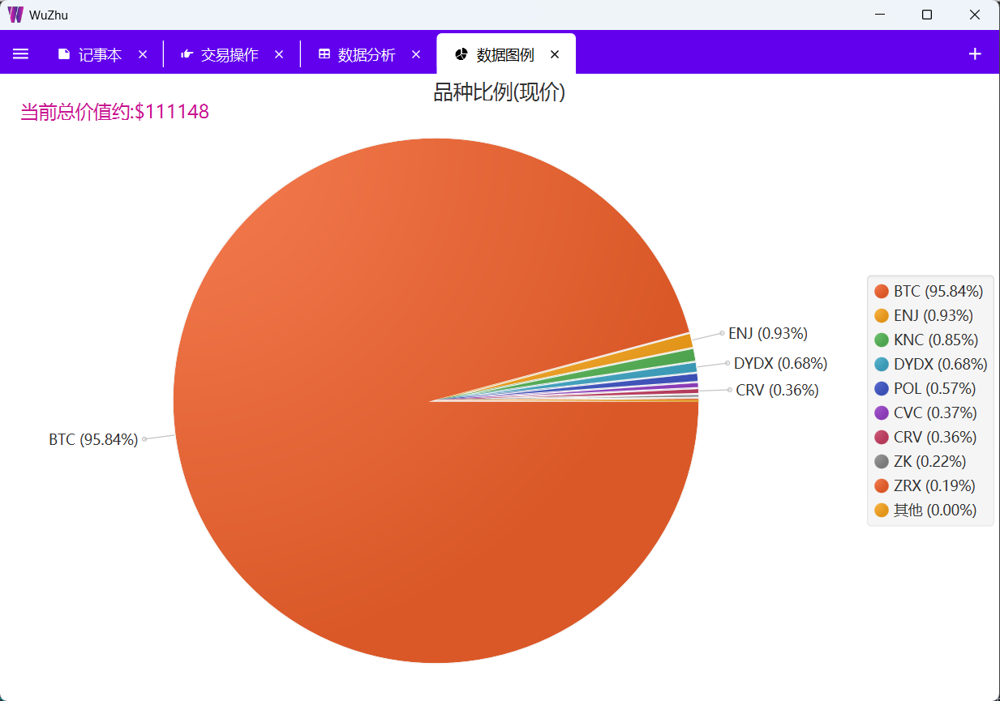

# WuZhu 🪙

<div align="right">

[English](README.md) | **简体中文**

</div>

[](https://www.oracle.com/java/)
[](https://spring.io/projects/spring-boot)
[](https://openjfx.io/)
[](LICENSE)

**WuZhu** 是一款专为加密货币交易者和投资者设计的交易日记与投资组合分析桌面应用程序。它提供全面的工具来记录、跟踪和分析您的加密货币交易，并提供实时市场数据支持。

<p align="center">
  
</p>

---

## 📋 目录

- [功能特性](#-功能特性)
- [截图展示](#-截图展示)
- [安装指南](#-安装指南)
  - [Ubuntu](#ubuntu-2404)
  - [Windows](#windows)
- [开发指南](#-开发指南)
- [使用说明](#-使用说明)
- [系统架构](#-系统架构)
- [参与贡献](#-参与贡献)
- [许可证](#-许可证)

---

## ✨ 功能特性

### 📊 交易管理
- **交易记录**：记录买卖交易详情（日期、价格、数量、交易对）
- **现金管理**：跟踪交易所的充值和提现操作
- **导入导出**：支持 CSV 格式进行数据迁移和备份

### 📈 分析与可视化
- **投资组合饼图**：可视化展示投资组合分配及当前市值
- **盈亏分析**：计算平均成本、当前盈亏及涨跌幅百分比
- **多币种支持**：按特定交易对筛选和分析交易记录

### 💼 市场数据集成
- **CoinMarketCap API**：获取 CoinMarketCap 的实时加密货币价格数据
- **代理支持**：配置 HTTP 代理访问 CoinMarketCap API
- **可定制更新**：根据偏好设置自动或手动更新价格数据

### 🛠️ 其他功能
- **富文本笔记**：内置记事本用于记录交易策略和备忘
- **主题切换**：支持浅色和深色主题
- **多语言就绪**：支持国际化
- **小额币种过滤**：在投资组合视图中隐藏小额价值币种

---

## 📸 截图展示

> 截图文件存放在 `docs/screenshots/` 目录中。

### 主界面
<!--  -->
*主应用窗口，显示工作台仪表板*

### 交易模块
<!--  -->
*交易信息模块，用于记录买卖交易*

### 投资组合分析
<!--  -->
*统计分析和盈亏分析视图*

### 投资组合图表
<!--  -->
*投资组合分配饼图*

> 💡 **添加截图方法**：将图片文件放入 `docs/screenshots/` 目录，然后取消上方 markdown 代码的注释。

---

## 🚀 安装指南

### 系统要求

- **Java 21 JDK**（运行应用必需）
- **Maven 3.8+**（可选，项目已包含 Maven Wrapper）

### Ubuntu 24.04

#### 方案一：使用 .deb 包（推荐）

```bash
# 下载最新版本
curl -LO https://github.com/lifxue/WuZhu/releases/download/v1.0.0/wuzhu_1.0.0_amd64.deb

# 安装软件包
sudo dpkg -i wuzhu_1.0.0_amd64.deb

# 如有需要，修复依赖问题
sudo apt-get install -f

# 启动应用
wuzhu
```

#### 方案二：从源码构建

```bash
# 克隆仓库
git clone https://github.com/lifxue/WuZhu.git
cd WuZhu

# 构建项目
./mvnw clean package -DskipTests

# 运行应用
java -jar target/WuZhu-1.0.jar
```

### Windows

#### 方案一：使用 .msi 安装程序（推荐）

1. 从 [Releases](https://github.com/lifxue/WuZhu/releases) 下载最新的 `.msi` 安装程序
2. 运行安装程序并按照向导完成安装
3. 从开始菜单或桌面快捷方式启动 WuZhu

#### 方案二：从源码构建

```powershell
# 克隆仓库
git clone https://github.com/lifxue/WuZhu.git
cd WuZhu

# 构建项目
.\mvnw.cmd clean package -DskipTests

# 运行应用
java -jar target\WuZhu-1.0.jar
```

---

## 🛠️ 开发指南

### 环境配置

#### 所需软件

| 软件 | 最低版本 | 说明 |
|------|---------|------|
| Java JDK | 21 | 必须使用 JDK（而非 JRE），推荐：BellSoft Liberica JDK 21 Full |
| Maven | 3.8+ | 可选，项目包含 Maven Wrapper（`./mvnw`） |
| Git | 任意 | 用于克隆仓库 |

### 快速开始（跨平台通用）

```bash
# 1. 克隆仓库
git clone https://github.com/lifxue/WuZhu.git
cd WuZhu

# 2. 构建项目
./mvnw clean package -DskipTests

# 3. 运行应用
./mvnw spring-boot:run
# 或
java -jar target/WuZhu-1.0.jar
```

### 开发命令

```bash
# 清理并编译（不打包）
./mvnw clean compile

# 运行测试
./mvnw test

# 打包（跳过测试快速构建）
./mvnw clean package -DskipTests

# 完整构建流程
./mvnw clean compile test package

# 调试模式（端口 5005）
./mvnw spring-boot:run -Dspring-boot.run.jvmArguments="-agentlib:jdwp=transport=dt_socket,server=y,suspend=n,address=*:5005"
```

### IDE 配置

#### IntelliJ IDEA

1. 导入项目：`File -> Open` 选择 `pom.xml`
2. 启用注解处理：`Settings -> Build -> Annotation Processors -> Enable`
3. 设置 JDK：`Project Structure -> SDKs` 添加 JDK 21

#### VS Code

推荐插件：
- Extension Pack for Java
- Spring Boot Extension Pack
- Lombok Annotations Support

---

## 📖 使用说明

### 首次设置

1. **启动应用** - WuZhu 将在首次运行时自动创建数据库
2. **配置 API 密钥** - 进入设置（偏好设置）并输入您的 CoinMarketCap API 密钥
   - 从以下网址获取免费 API 密钥：https://pro.coinmarketcap.com/signup
3. **选择币种** - 进入币种选择（币种选择）选择要跟踪的加密货币
4. **开始记录交易** - 使用交易信息（交易信息）模块记录您的交易

### 模块说明

#### 📝 交易信息（交易信息）
记录和管理加密货币买卖交易。
- 选择基准货币和计价货币
- 输入价格、数量和日期
- 以表格形式查看所有交易
- 编辑或删除现有记录

#### 💰 现金（现金）
跟踪交易所的充值和提现。
- 记录充值（入金）和提现（出金）
- 单独管理 USDT 交易
- 历史记录跟踪

#### 📊 统计分析（统计分析）
分析投资组合表现。
- 查看特定币种或整个投资组合的盈亏
- 按日期范围和交易类型筛选
- 显示平均成本、当前价值和涨跌幅百分比

#### 🥧 饼图（饼图）
投资组合分配的可视化展示。
- 显示每个持仓的当前市值
- 显示百分比分配
- 鼠标悬停在扇区上查看详细信息
- 可选择隐藏小额价值币种

#### 🔍 币种选择（币种选择）
选择要跟踪和显示的加密货币。
- 搜索特定币种
- 使用复选框启用/禁用币种
- 数据与 CoinMarketCap 同步

#### ⚙️ 偏好设置（偏好设置）
配置应用设置。
- 主题选择（浅色/深色）
- CoinMarketCap API 密钥
- 代理设置
- 自动更新价格数据
- 小额币种过滤阈值
- 数据库初始化

#### 📝 笔记（笔记）
内置富文本编辑器。
- 策略标签用于记录交易策略
- 备忘标签用于一般笔记
- 支持富文本格式

#### 📁 导入导出
导入和导出交易数据。
- 将所有交易记录导出为 CSV
- 从 CSV 导入交易记录
- 支持数据备份和迁移

---

## 🏗️ 系统架构

### 技术栈

| 组件 | 版本 | 用途 |
|------|------|------|
| Java | 21 | 编程语言 |
| Spring Boot | 2.7.10 | 应用框架 |
| JavaFX | 21.0.2 | 桌面 UI 框架 |
| [WorkbenchFX](https://github.com/dlsc-software-consulting-gmbh/WorkbenchFX) | 11.3.1 | 工作台风格 UI 框架 |
| H2 Database | 2.2.220 | 嵌入式数据库 |
| OpenFeign | 2021.0.3 | API HTTP 客户端 |
| Lombok | 1.18.30 | 代码生成 |
| MapStruct | 1.5.5 | 对象映射 |
| RichTextFX | 0.11.0 | 富文本编辑 |

### 项目结构

```
WuZhu/
├── src/main/java/org/lifxue/wuzhu/
│   ├── config/           # 配置（Feign、代理）
│   ├── convert/          # MapStruct 转换器
│   ├── dto/              # 数据传输对象
│   ├── enums/            # 枚举类
│   ├── modules/          # 功能模块（8个业务模块）
│   │   ├── cash/         # 现金管理
│   │   ├── file/         # 导入导出
│   │   ├── note/         # 笔记（富文本）
│   │   ├── piechart/     # 投资组合饼图
│   │   ├── selectcoin/   # 币种选择
│   │   ├── setting/      # 偏好设置
│   │   ├── statistics/   # 统计分析
│   │   └── tradeinfo/    # 交易记录
│   ├── pojo/             # JPA 实体类
│   ├── repository/       # 数据访问层
│   ├── service/          # 服务层
│   ├── springfx/         # Spring-JavaFX 集成
│   └── util/             # 工具类
└── src/main/resources/   # FXML、CSS、配置文件
```

### 应用架构

```
WuZhuApplication.main()
    ↓
Application.launch(JavaFxApplication.class)
    ↓
JavaFxApplication.init() → 初始化 Spring 上下文
    ↓
JavaFxApplication.start() → 发布 StageReadyEvent
    ↓
PrimaryStageInitializer → 初始化 WorkbenchFX + 加载模块
```

### 数据库

- **类型**：H2 嵌入式数据库
- **文件位置**：`~/.wuzhu/h2/wuzhudbjpa`
- **模式**：`ddl-auto: update`（自动更新架构）
- **备份**：只需复制 `.wuzhu` 目录

### API 集成

应用与 **CoinMarketCap API** 集成以获取实时加密货币数据：

- **API 端点**：https://pro-api.coinmarketcap.com
- **认证**：通过 `X-CMC_PRO_API_KEY` 头部发送 API 密钥
- **速率限制**：受限于 CoinMarketCap API 等级

---

## 🤝 参与贡献

欢迎贡献！请随时提交 Pull Request。

1. Fork 本仓库
2. 创建您的功能分支（`git checkout -b feature/AmazingFeature`）
3. 提交您的更改（`git commit -m 'Add some AmazingFeature'`）
4. 推送到分支（`git push origin feature/AmazingFeature`）
5. 打开 Pull Request

---

## 📄 许可证

本项目采用 Apache License 2.0 许可证 - 详情请参见 [LICENSE](LICENSE) 文件。

---

## 🙏 致谢

- [CoinMarketCap](https://coinmarketcap.com/) 提供加密货币市场数据
- [Spring Boot](https://spring.io/projects/spring-boot) 提供优秀的框架
- [JavaFX](https://openjfx.io/) 提供现代桌面 UI 框架
- [WorkbenchFX](https://github.com/dlsc-software-consulting-gmbh/WorkbenchFX) 提供工作台风格 UI

---

## 📞 支持

如果您遇到任何问题或有疑问，请在 GitHub 上 [提交 Issue](https://github.com/lifxue/WuZhu/issues)。

---

<p align="center">
  用 ❤️ 制作 <a href="https://github.com/lifxue">lifxue</a>
</p>
